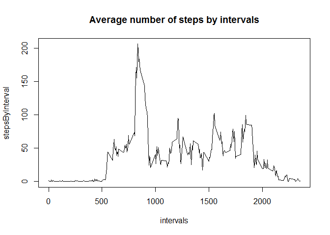

# Reproducible Research: Peer Assessment 1


##Loading and preprocessing the data

####Download, unzip file, write the access date and time

[URL for downloading the data](https://d396qusza40orc.cloudfront.net/repdata%2Fdata%2Factivity.zip)  
Data for this report was downloaded: Tue May 12 09:42:09 2015

####read CSV file

```r
unzip("repdata_data_activity.zip")
givenData<-read.csv(file="activity.csv")
```


  
##What is mean total number of steps taken per day?  

####Calculate the total number of steps taken per day

```r
stepsPerDay<-tapply(givenData$steps, givenData$date, sum, na.rm=T)
```

####Make a histogram of the total number of steps taken each day

```r
hist(stepsPerDay, xlab="steps per day", breaks=20, col="grey90", main="Total number of steps taken each day")
abline(v=mean(stepsPerDay, na.rm=T), lwd=2, col="orange")
abline(v=median(stepsPerDay, na.rm=T), lwd=2, col="blue")
legend("topright", lwd=2, cex=.9, col=c("orange", "blue"), legend=c("mean", "median"))
```

 

####Calculate the mean and median of the total number of steps taken per day

```r
meanSteps<-mean(stepsPerDay, na.rm=T)
medianSteps<-median(stepsPerDay, na.rm=T)
```

- The mean of the total number of steps taken per day: **9354.2295082**.  
- The median of the total number of steps taken per day: **10395**.


  
##What is the average daily activity pattern?  

####Make a time series plot of the 5-minute interval (x-axis) and the average number of steps taken, averaged across all days (y-axis)

```r
stepsByInterval<-tapply(givenData$steps, givenData$interval, mean, na.rm=T)
intervals<-names(stepsByInterval)
plot(x=intervals, y=stepsByInterval, type="l", main="Average steps by intervals")
```

 

####Which 5-minute interval, on average across all the days in the dataset, contains the maximum number of steps?

```r
intervalWithMax<-names(which.max(stepsByInterval))
```
Interval with maximum steps: **835**.


  
##Imputing missing values  

####Calculate and report the total number of missing values in the dataset

```r
totalNA<-as.integer(0)
for (i in 1:nrow(givenData)) {
    if (is.na(givenData[i,1])) { totalNA=totalNA+1 }
}
```
Total number of missing values in dataset: **2304**.

####Create a new dataset that is equal to the original dataset but with the missing data filled in. 
Each missing value will be replaced with median value for this 5-minute interval, because mediana doesn't depend on extreme values that can be caused by unusual circumstances.  

```r
medianStepsByInterval<-tapply(givenData$steps, givenData$interval, median, na.rm=T)
newDF<-givenData

for (j in 1:nrow(newDF)) {
    if (is.na(newDF[j,1])) {
        foundedInterval<-as.character(newDF[j,3])
        newDF[j,1]<-medianStepsByInterval[foundedInterval]
    }
}
```

####Make the same calculations for new data frame
Calculate the total number of steps per day for new data frame without missing values.

```r
newStepsPerDay<-tapply(newDF$steps, newDF$date, sum)
```
Calculate mean and median total number of steps taken per day for new data frame.

```r
newMeanSteps<-mean(newStepsPerDay)
newMedianSteps<-median(newStepsPerDay)
```

- The mean of the total number of steps taken per day: **9503.8688525**.  
- The median of the total number of steps taken per day: **10395**.

Make a histogram of the total number of steps taken each day for new data set with replaced missing values.

```r
hist(newStepsPerDay, breaks=20, col="grey90", main="Number of steps per day, for new data set with replaced NAs", xlab="steps per day")
abline(v=newMeanSteps, lwd=2, col="orange")
abline(v=newMedianSteps, lwd=2, col="blue")
legend("topright", lwd=2, cex=.9, col=c("orange", "blue"), legend=c("mean", "median"))
```

 

####Do new values differ from the estimates from the first part of the report? What is the impact of imputing missing data on the estimates of the total daily number of steps?
Previous mean value of the number of steps was less: **9354.2295082 < 9503.8688525**. And previous median value is the same as new one: **10395 == 10395**, that's because mediana was used to replace missing values. New histogram looks like the previous. 


##Are there differences in activity patterns between weekdays and weekends?

Create a new factor variable.

```r
dayType<-rep("", nrow(newDF))
for(i in 1:nrow(newDF)) {
    if(weekdays(as.Date(newDF[i,2]))=="суббота" | weekdays(as.Date(newDF[i,2]))=="воскресенье" | weekdays(as.Date(newDF[i,2]))=="saturday" | weekdays(as.Date(newDF[i,2]))=="sunday") {
        dayType[i]<-2
    } else dayType[i]<-1
}
dayType<-as.factor(dayType)
levels(dayType)<-c("weekday","weekend")
```
Add new column to dataset

```r
newDF$dayType<-dayType
```

  
  
####Make a panel plot containing a time series plot of the 5-minute interval (x-axis) and the average number of steps taken, averaged across all weekday days or weekend days (y-axis).  

Construct data frame with information need for making a plot.

```r
#list of two data frames: data for weekdays are separeted from data for weekends
splittedByDaytype<-split(newDF, newDF$dayType)  

#operate separetly with data frame for weekdays and data frame for weekends, find average number of steps per interval
weekdaysData<-splittedByDaytype[[1]]
weekendsData<-splittedByDaytype[[2]]
weekdaysData<-tapply(weekdaysData$steps, weekdaysData$interval, mean)
weekendsData<-tapply(weekendsData$steps, weekendsData$interval, mean)

#constructing factor variable for types of days
dayType<-rep("weekday", length(weekdaysData))
dayType<-c(dayType, rep("weekend", length(weekendsData)))

#construct new data frame which contains 3 variables needed for making plots
stepsPerIntervalByDaytype<-data.frame(interval=as.integer(c(names(weekdaysData), names(weekendsData))), averageSteps=as.numeric(c(weekdaysData, weekendsData)), dayType=as.factor(dayType))
```
  
  
  Make a panel plot.

```r
library(lattice)
xyplot(averageSteps~interval|dayType, data=stepsPerIntervalByDaytype, type="l",layout = c(1, 2))
```

 
  
  On the whole periods of activity are roughly the same. But weekdays are more intensive. In accordance to the graphics there were some weekdays with large number of steps in the morning, and time between 750 and 1000 is often very active unlike the same perion on the weekend. 
